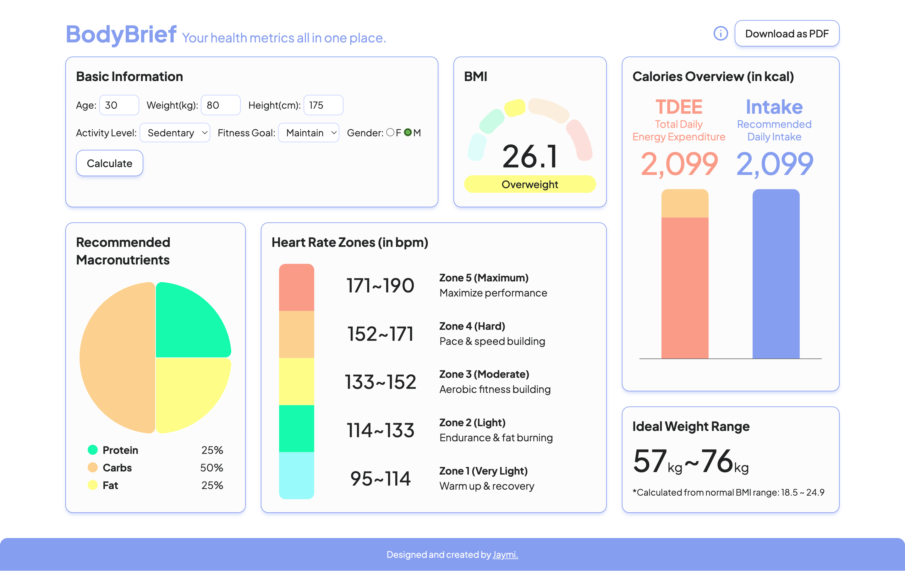

# BodyBrief Health Metrics Dashboard

BodyBrief is a quick health metrics calculator designed to help you understand common fitness-related numbers gathered all in one place. Created with accessibility in mind, this project is properly set up with ARIA tags for screen reader users.

Live demo: [Click Here](https://jaymiyam.com/bodybrief-dashboard/)

## Screenshot

## Features

BodyBrief takes the biological variables (e.g. age, height) that users provide through the form once, then calculate and provide the below health metrics in the form of charts as well as numbers:

- BMI (body mass index)
- Calories overview - Total daily energy expenditure, recommended daily intake
- Training heart rate zones
- Macronutrients ratio
- Ideal weight range

BodyBrief also supports **downloading the dashboard as PDF** for users to store the information.

## Tech Stack

- TypeScript
- React
- Vite
- TailwindCSS - styling framework
- Recharts - charting library
- html-to-image & jspdf - Download as PDF function

## Learning Summary

- Bento grid styling & layout arrangements
- 3rd party charting library usage
- Implement DOM to PDF export functionality with 3rd party packages
- Web accessibility & perforance improvements
- Combining customs classes with Tailwind utility classes
